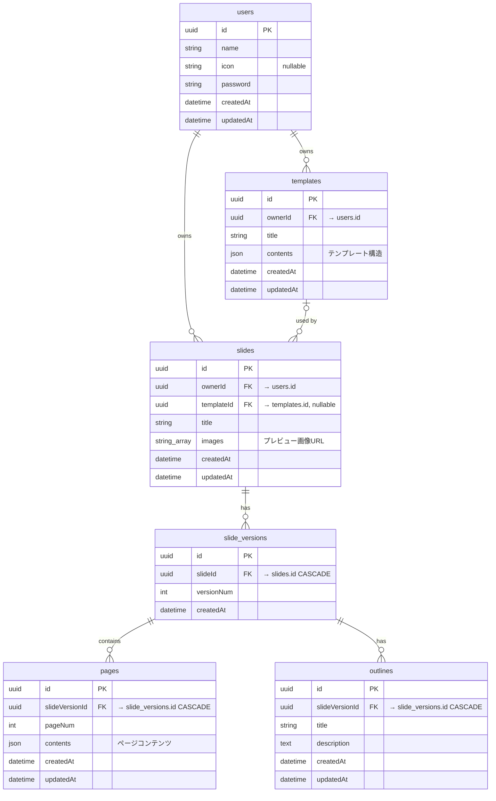

# Slide Turbo — アーキテクチャ設計書

## ERD



## ディレクトリ構成

```
backend/app/
├── main.py                              # FastAPI エントリーポイント
│
├── core/                                # 横断的関心事
│   ├── config.py                        #   環境変数 (Pydantic Settings)
│   ├── db.py                            #   Prisma クライアント
│   ├── auth.py                          #   認証 Dependency (get_current_user)
│   └── security.py                      #   JWT / パスワードハッシュ
│
├── shared/                              # 共通ユーティリティ
│   └── exceptions.py                    #   アプリ例外 (NotFoundException 等)
│
├── domain/                              # ドメイン層 (最内層, 外部依存なし)
│   ├── user/
│   │   ├── entity.py                    #   User エンティティ
│   │   └── service.py                   #   バリデーション等
│   ├── template/
│   │   ├── entity.py                    #   Template エンティティ
│   │   └── service.py                   #   contents 検証
│   ├── slide/
│   │   ├── entity.py                    #   Slide, SlideVersion, Page
│   │   └── service.py                   #   バージョニング / ページ順序
│   └── outline/
│       ├── entity.py                    #   Outline (骨子)
│       └── service.py                   #   骨子バリデーション
│
├── application/                         # アプリケーション層 (UseCase + DTO)
│   ├── user/
│   │   ├── dto.py                       #   Register/Login/Response DTO
│   │   └── usecases.py                  #   register, login, get_me, update
│   ├── template/
│   │   ├── dto.py                       #   Create/Import/Response DTO
│   │   └── usecases.py                  #   CRUD + Google Slides import
│   ├── slide/
│   │   ├── dto.py                       #   Slide/Version/Page DTO
│   │   └── usecases.py                  #   CRUD + version + page 操作
│   └── outline/
│       ├── dto.py                       #   Create/Refine/Response DTO
│       └── usecases.py                  #   CRUD + AI refine
│
├── infrastructure/                      # インフラ層 (外部依存の実装)
│   ├── persistence/                     #   Prisma リポジトリ
│   │   ├── user_repository.py
│   │   ├── template_repository.py
│   │   ├── slide_repository.py
│   │   └── outline_repository.py
│   ├── google_slides/                   #   Google Slides 連携
│   │   ├── client.py                    #     API クライアント
│   │   ├── parser.py                    #     プレゼンパーサー
│   │   └── exporter.py                  #     PPTX 出力
│   └── ai/                              #   AI / マルチエージェント (TBD)
│
└── presentation/                        # プレゼンテーション層 (API)
    ├── api.py                           #   ルーター集約 (/api/v1)
    └── routers/
        ├── user_router.py               #   POST register/login, GET/PATCH me
        ├── template_router.py           #   CRUD + import
        ├── slide_router.py              #   CRUD + versions + pages
        └── outline_router.py            #   CRUD + refine
```

## レイヤー依存ルール

```
┌─────────────────────────────────────────────────┐
│   presentation/  (FastAPI Router, Schema)        │
│   ↓ Depends()                                    │
├─────────────────────────────────────────────────┤
│   application/   (UseCase, DTO)                  │
│   ↓ import                                       │
├─────────────────────────────────────────────────┤
│   domain/        (Entity, Service)               │
│   ※ 外部依存なし (純粋 Python + Pydantic)          │
├─────────────────────────────────────────────────┤
│   infrastructure/ (Prisma, Google API, AI)        │
│   ※ domain の Entity を返す                       │
│   ※ application の UseCase から呼ばれる            │
└─────────────────────────────────────────────────┘
```

## API エンドポイント一覧

| Method | Path | 説明 |
|--------|------|------|
| POST | `/api/v1/users/register` | ユーザー登録 |
| POST | `/api/v1/users/login` | ログイン (JWT) |
| GET | `/api/v1/users/me` | 自分の情報 |
| PATCH | `/api/v1/users/me` | プロフィール更新 |
| POST | `/api/v1/templates` | テンプレート作成 |
| POST | `/api/v1/templates/import` | Google Slides インポート |
| GET | `/api/v1/templates` | テンプレート一覧 |
| GET | `/api/v1/templates/:id` | テンプレート詳細 |
| PATCH | `/api/v1/templates/:id` | テンプレート更新 |
| DELETE | `/api/v1/templates/:id` | テンプレート削除 |
| POST | `/api/v1/slides` | スライド新規作成 |
| GET | `/api/v1/slides` | スライド一覧 |
| GET | `/api/v1/slides/:id` | スライド詳細 |
| PATCH | `/api/v1/slides/:id` | スライド更新 |
| DELETE | `/api/v1/slides/:id` | スライド削除 |
| POST | `/api/v1/slides/:id/versions` | 新バージョン作成 |
| GET | `/api/v1/slides/:id/versions` | バージョン一覧 |
| POST | `/api/v1/slides/versions/:vid/pages` | ページ追加 |
| GET | `/api/v1/slides/versions/:vid/pages` | ページ一覧 |
| PATCH | `/api/v1/slides/pages/:pid` | ページ更新 |
| POST | `/api/v1/outlines` | 骨子作成 |
| GET | `/api/v1/outlines/by-version/:vid` | 骨子一覧 |
| GET | `/api/v1/outlines/:id` | 骨子詳細 |
| PATCH | `/api/v1/outlines/:id` | 骨子更新 |
| DELETE | `/api/v1/outlines/:id` | 骨子削除 |
| POST | `/api/v1/outlines/refine` | AI 骨子ブラッシュアップ |
| GET | `/health` | ヘルスチェック |
